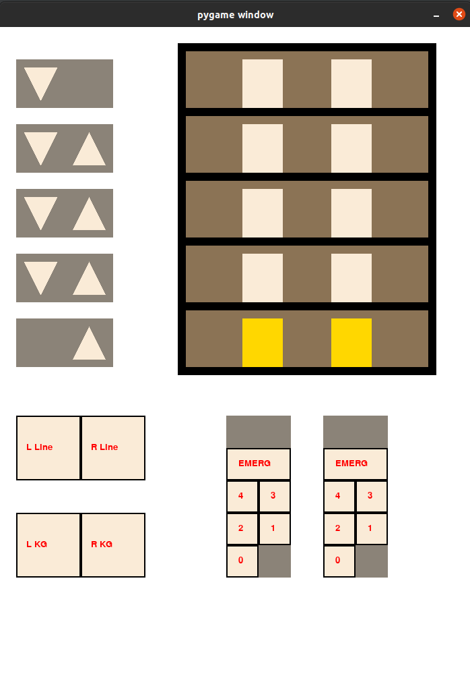

# SCADA fo group of lift

Project for Hardware and software of control systems classes

## Getting started:

### Dependencies:
- Python 3.x
- pygame>=2.0.1

### Staring the application:
```bash
python3 lifts.py
```

## Application interface

